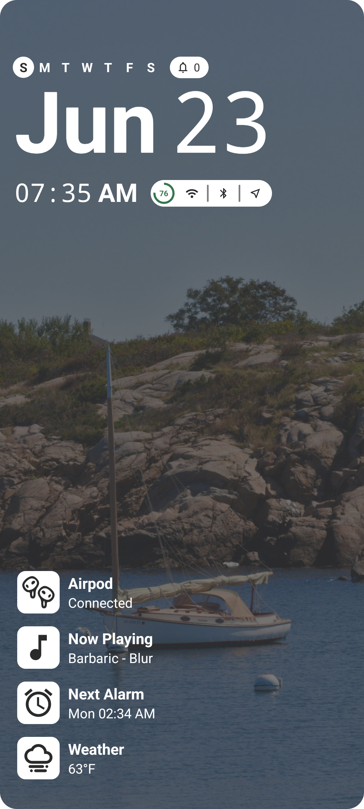
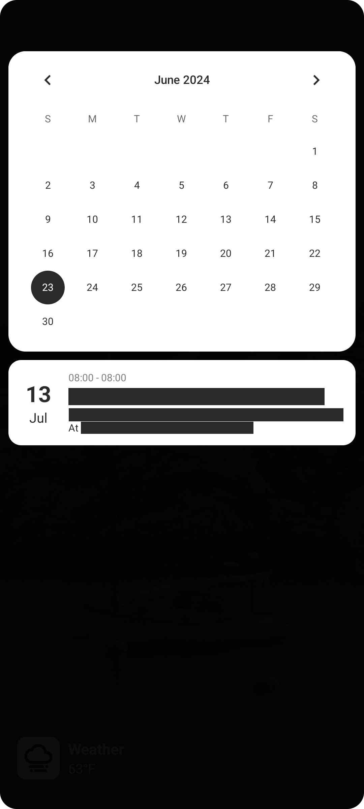
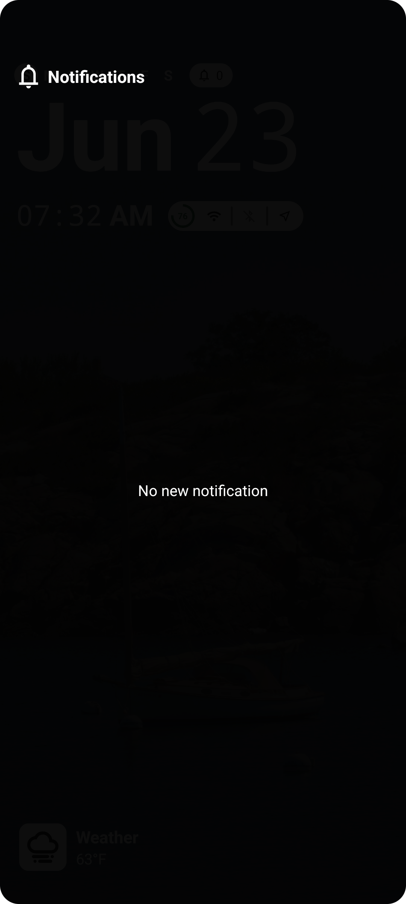
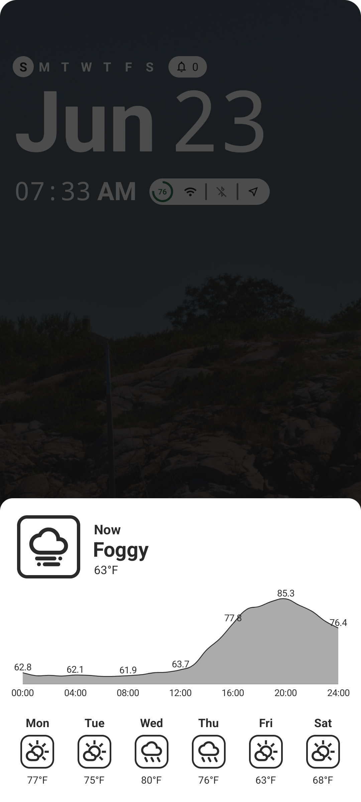

 
<h1 align="center"><b>Monospace</b></h1>
<h4 align="center">A simplistic launcher, integrates all you need  in one space</h4>

## Screenshots

## Feature
- Lightweight and privacy focused, no telemetry in the background
- Necessary daily widgets on the home left bottom corner, including notification, media, weather (and bonus airpod battery tracker)
- Widgets comes with a customized dialog:
  - Notification: Allows viewing and clearing notification without pulling down the status bar
  - Media: Allows play/pause and skip tracks of any current media player
  - Weather: Allows the track today's + next 7 days weather condition and temperature. This requires users' location for one time only, after that, the app will fetched from that saved location
  - Airpod (Optional): Allows to track airpod's (case + individual pods) battery. This requires my fork of OpenPods to be installed, available [here](https://github.com/reesque/OpenPods)
 
## Special thanks to
- Thank you [OpenMeteo](https://open-meteo.com/) for providing us with the free API
- Thank you [OpenPods](https://github.com/adolfintel/OpenPods/) team for their hardwork on discovering and creating an open source application for Apple's product integration

## License
This program is under GNU GENERAL PUBLIC LICENSE Version 3, 29 June 2007. Please do not re-upload it to the Google PlayStore.

Copyright (C) 2024 Khoa Nguyen (Risky/Reesque)
